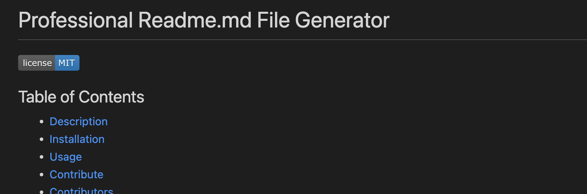

# Professional README file generator

## Table of Contents
* [Description](#description)
* [Installation](#installation)
* [Usage](#usage)
* [Contribute](#contribute)
* [Contributors](#contributors)
* [Testing](#tests)
* [License](#license)
* [Questions](#questions)
## Description
This app is a professional readme file generator. This is designed to help developers to quickly create a professional  README file for their projects. It is a fun way of creating a README file.

## Screenshots

## Installation
Go to the github repository and clone the project into a local directory at your computer.

Before you can start using the app, please ensure you have package.json in your folder. 

Now run the following command in terminal to install dependencies you need for the project.

If you do not find the package.json file, please run the following commands on your terminal.

After you have run this command, package-lock.json file and node modules folder will be created.

Now you can run the following command.

You will be asked a questions about your project.

Once all questions have been answered the README.md file will be generated.

## Usage
Please refer to section above about the usage.

You can also refer to the following vide for a demonstration of the project.

## Tests
TBA

## Contribute
This is an open-source project and you are welcome to add features to the project. Please feel free to create a pull request. You may also contact me via link in the questions section for any ideas/concerns you would like to share.
## Contributors

I would like acknowledge my tutors Jack Song and Sid Baral of Monash University Coding Camp to teach the concepts that have helped in creating this project.

## License
This project is created under MIT license.

Users of software using an MIT License are permitted to use, copy, modify, merge publish, distribute, sublicense and sell copies of the software

## Questions
If you have any questions or suggestions please [contact](mailto:sanjaybenu@gmail.com?subject=README_file_generator) or visit [github/sanjaybenu](https://github.com/sanjaybenu)
